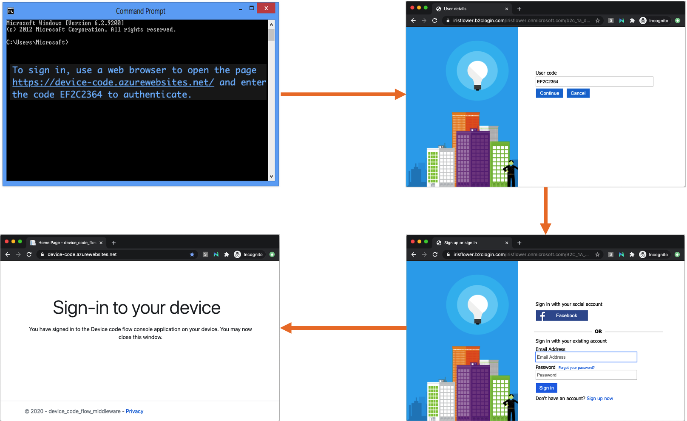
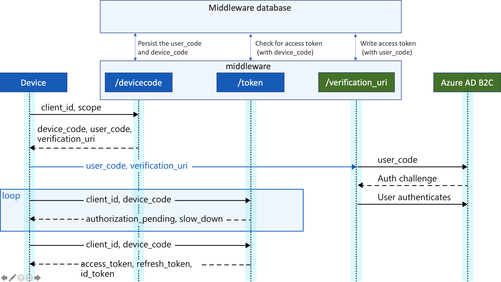

# Azure AD B2C custom OAuth 2.0 device authorization grant flow

This solution is POC for a custom [device authorization grant](https://tools.ietf.org/html/rfc8628), which allows users to sign in to input-constrained devices such as a smart TV, IoT device, or printer, with Azure AD B2C as the identity provider.  To enable this flow, the device has the user visit a webpage in their browser on another device to sign in.  Once the user signs in, the device is able to get access tokens and refresh tokens as needed.



## Disclaimer and known issues

- The sample is not supported under any Microsoft standard support program or service. The sample is provided AS IS without warranty of any kind. The entire risk arising out of the use or performance of the sample documentation remains with you.

- Refresh token is not yet supported. 
- Error handling is missing. For example, checking the expiration of the user_code.
- Search for TBD notes in the code
- Azure AD B2C may need to validate the user_code. Also may change to order, first sign-in, then provide the user_code.

## Sign-in flow

The entire device code flow looks similar to the next diagram.



1. The device invokes the middleware `/devicecode` endpoint to initiate authentication. The device endpoint:
    1. Generates `device_code` and `user_code` and stores them in a temporary database.
    1. Returns `device_code`, `user_code` and `verification_uri` to the device. From the moment this request is sent, the user has a limited amount time to sign in, so only make this request when the user has indicated they're ready to sign in.

1. After receiving the `user_code`, the device displays it to the user, along with the `verification_uri`, instructing users to sign in using their mobile phone or PC web browser.

1. The user navigates to the middleware sign-in page. The middleware initiates [OAuth2 authorization code flow](https://docs.microsoft.com/azure/active-directory-b2c/authorization-code-flow) taking the user to Azure AD B2C to complete the sign-in. 

1. The user types the `user_code`, and clicks next to sign-in with Azure AD B2C local or social account.

1. While the user is authenticating, the device should be polling the middleware `/token` endpoint for the requested token using the device_code. 

1. After user completes the sign-in, the user is redirected back to the middleware. The middleware acquires an access token, validates it and extract some information, such as the user_code. Using the user_code, it persists the access token to the corresponding entity in the database.

1. On the next device call to the `/token` endpoint, the middleware returns the access token and delete the entity from the database. 

## Artifacts

### The middleware VS Code project

The middleware is base on Azure AD B2C official sample [How to secure a Web API built with ASP.NET Core using the Azure AD B2C](https://github.com/Azure-Samples/active-directory-aspnetcore-webapp-openidconnect-v2/tree/master/4-WebApp-your-API/4-2-B2C).

 - **Controllers\HomeController.cs** - The post sign-in page, where the middleware gets the access token and renders the sign-in completed message
- **Controllers\Oauth2Controller.cs** - The DeviceCode and Token endpoints
- **Models\AppSettingsModel.cs** - App settings (reflects the appsettings.json AppSettings section) 
- **Models\DeviceEntity.cs** - [Azure Cosmos DB entity](https://docs.microsoft.com/azure/cosmos-db/tutorial-develop-table-dotnet) that presents authorization request.
- **Models\TraceEntity.cs** - [Azure Cosmos DB entity](https://docs.microsoft.com/azure/cosmos-db/tutorial-develop-table-dotnet), use for debug purposes.
- **Services\TablesService.cs** - Azure Cosmos DM integration.
- **Services\StringHelper.cs** - Some string manipulation.
- **appsettings.json** - Azure AD B2C federation setting, and custom application settings

### The console application

The console app [](https://github.com/Azure-Samples/active-directory-dotnetcore-devicecodeflow-v2/tree/master/device-code-flow-console) shows a public client application running on a device without a web browser. The app can be a command-line tool, an app running on Linux or Mac, or an IoT application. When running the application, you should see following authorization challenge. 

_To sign in, use a web browser to open the page https://device-code.azurewebsites.net/ and enter the code EF2C2364 to authenticate._

The `Program.cs` file contains most of the code with the parameters are hard coded:

```csharp
string[] Scopes = new string[] { "https://tenantname.onmicrosoft.com/api1/read" };
msalAppOptions.ClientId = "not in used";

// The address of the middleware web application (must be HTTPS). The MSAL will make a call to
// https://server-name/common/oauth2/v2.0/devicecode
// https://server-name/common/oauth2/v2.0/token
msalAppOptions.Instance = "https://device-code.azurewebsites.net/";
```

### Azure AD B2C policy

1. Asks the user to type the user_code.
1. Sing-in or sign-up, with local or social account.
1. Add the user_code to the token and return the token back to the middleware.
